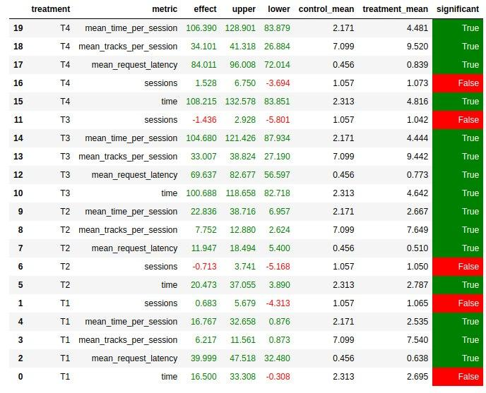

# Отчет по домашнему задания
Выполнила Рындина Валерия, M33351

## Подготовка данных

[Ноутбук](jupyter/HomeworkValRun.ipynb) с подготовкой данных для симулятора, визуализацией и всем таким.

## Рекомендер

[Реализация](botify/botify/recommenders/valrunrecommender.py)

### Abstract:
* Если трек не понравился (меньше 0,6 прослушано):
  * Холодные пользователи:
    * Случайный трек из ТОР-50
  * Не холодные:
    * Из личного топа пользователя взять трек
* Если понравился:
  * Взять похожий на этот трек

  
* Что значит "взять похожий"?
  * Случайный трек из топ похожих треков для данного артиста

## Результаты

* T1 - Indexed
* T2 - Contextual
* T3 - StickyArtist
* T4 - мой рекомендер

Что можно сказать: мои результаты примерно на уровне StickyArtist, но лучше. 
Будем честны, в реальной жизни, если человек, захочет послушать одного исполнителя, он его и включит, а не "botify"
Поэтому хочу верить, что я справилась с домашним заданием.
